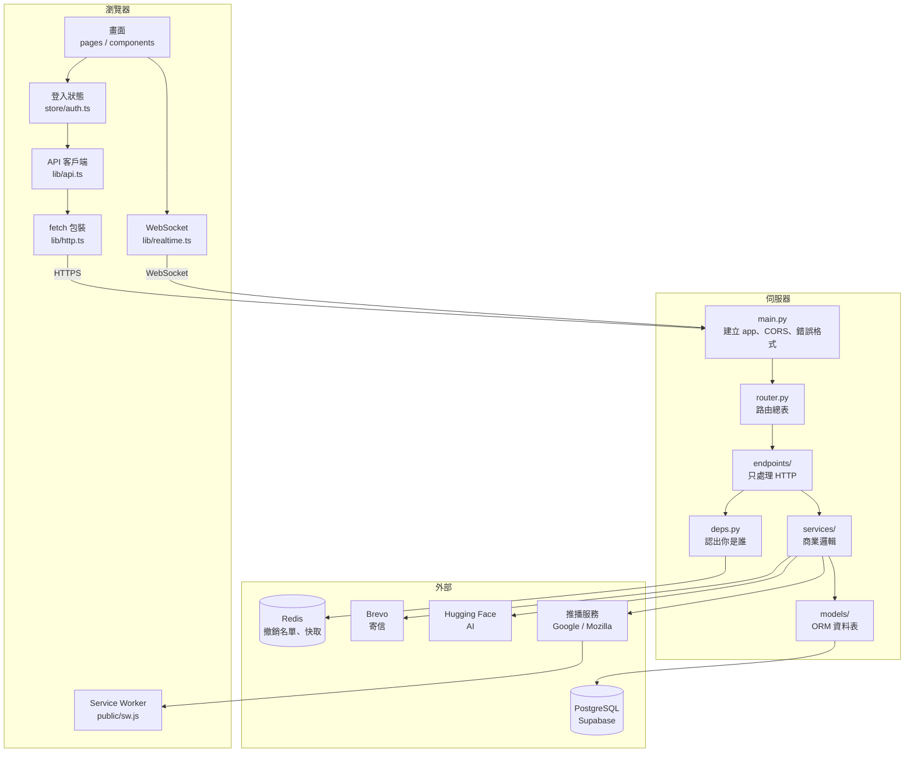

# 讀碼指南 —— 從地基往上讀 Friends World

這份文件是給**要看懂這個專案的人**寫的，不是 API 文件。

它的順序刻意不是「照資料夾排」，而是**照相依方向排**：先讀不依賴任何東西的
底層，再讀建立在它之上的一層。這樣讀，每一份檔案打開時，它用到的東西你都
已經認識了 —— 不會出現「這個 `get_current_user` 是什麼？」然後跳去別的檔案，
再從那裡跳到第三個檔案，最後忘記自己本來在看什麼。

---

## 先看全貌



一句話總結資料怎麼流：

> 使用者點畫面 → `lib/api.ts` 發一個 HTTP 請求 → `endpoints/` 收下 →
> `deps.py` 先確認你是誰 → `services/` 做事 → `models/` 動資料庫 →
> 原路回傳。如果這件事需要**通知別人**，`services/notify.py` 會另外從
> WebSocket 或 Web Push 推出去。

---

## 課程順序

每一課都對應一組檔案。**照順序讀**，前一課是後一課的前提。

| # | 課 | 讀哪些檔案 | 學到什麼 |
|---|---|---|---|
| 1 | [資料層](01-資料層.md) | `db/base.py`、`models/*.py` | 這個系統裡「存在」哪些東西、它們怎麼互相指涉 |
| 2 | 契約層 | `schemas/*.py`、`src/types.ts` | 進出 API 的形狀。為什麼不直接把 ORM 丟出去 |
| 3 | 基礎設施 | `core/config.py`、`db/session.py`、`core/security.py` | 設定從哪來、連線怎麼管、密碼與 JWT 怎麼處理 |
| 4 | 認證與相依注入 | `core/deps.py`、`services/revocation.py` | FastAPI 的 `Depends` 是什麼、伺服器怎麼認出你是誰 |
| 5 | 端點層 | `main.py`、`api/v1/router.py`、`endpoints/auth.py` | 一個請求從進來到出去的完整路徑 |
| 6 | 服務層 | `services/` 其餘各檔 | 商業邏輯為什麼要跟 HTTP 分開 |
| 7 | 即時性 | `endpoints/ws.py`、`services/realtime.py`、`notify.py`、`push.py` | WebSocket、Web Push、離線時通知怎麼追上 |
| 8 | 前端地基 | `main.tsx`、`App.tsx`、`lib/http.ts`、`lib/api.ts`、`store/auth.ts` | 前端怎麼開機、token 怎麼自動續期 |
| 9 | 前端狀態 | `lib/realtime.ts`、`presence.ts`、`notify.ts`、TanStack Query 的用法 | 伺服器狀態與畫面狀態的差別 |
| 10 | 畫面層 | `AppShell.tsx`、`pages/*.tsx`、`components/*.tsx` | 元件怎麼切、資料怎麼取 |
| 11 | 視覺層 | `StarField.tsx`、`CursorTrail.tsx`、`index.css` | Canvas 2D、疊合模式、為什麼加亮模式在白底上無效 |
| 12 | 上線 | `alembic/`、`render.yaml`、`.github/workflows/` | migration、部署、保溫 |

---

## 讀碼的三個習慣

這幾件事比記住任何一個 API 都重要。

**一、先問「這個檔案的職責是什麼」，再看它怎麼做。**
打開一個檔案先讀最上面的模組說明。如果讀完你講不出它一句話的職責，
那通常代表這個檔案的職責本身就不清楚 —— 那是設計問題，不是你的理解問題。

**二、註解要看的是 why，不是 what。**
`# 把 x 加一` 這種註解沒有價值，程式碼自己就說得出來。這個專案裡的註解
大多在回答「為什麼是這樣，而不是那個看起來更直覺的做法」。那些才是真正
花時間換來的東西 —— 通常背後都有一次踩過的坑。

**三、遇到看不懂的，先確認它是「不懂語法」還是「不懂決策」。**
前者查文件就好。後者要往上追一層：這個決定是為了解決什麼問題？
不解決會怎樣？這一層問完，程式碼才會從「一堆規則」變成「一連串取捨」。

---

## 怎麼跑起來

```bash
npm install
npm run dev
```

```bash
cd backend
python -m venv .venv
.venv/Scripts/python.exe -m pip install -r requirements.txt
.venv/Scripts/python.exe -m uvicorn app.main:app --reload --port 8000
```

後端預設用 SQLite，不需要申請任何帳號。互動式 API 文件在
<http://localhost:8000/docs> —— 讀端點層那一課時，把它開在旁邊對照著看。
