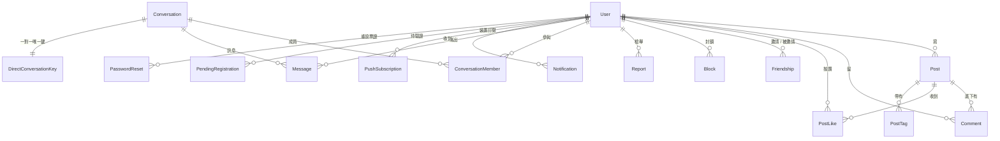

# 第 1 課：資料層

> 讀 `backend/app/db/base.py` 與 `backend/app/models/*.py`。
> 這是整個專案唯一**不依賴任何其他自家程式碼**的一層 —— 所以從這裡開始。

---

## 為什麼從資料開始

軟體有一條老規則：**先想清楚有哪些東西，再想它們能做什麼。**

原因很實際。函式寫錯了，改一支函式就好；資料表設計錯了，你要改的是資料表、
所有讀它的查詢、所有 API 的回應格式、前端每一個用到那個欄位的地方，
而且線上已經有真實資料在裡面 —— 你還得寫一支搬遷程式把舊資料轉過去。

**資料結構的錯誤，修正成本比程式邏輯高一個數量級。** 所以它值得先想、想久一點。

---

## 這個系統裡有哪些東西



`MediaObject` 與 `AppSecret` 沒有畫進去，因為它們不屬於任何人 ——
前者是內容定址的圖片（誰上傳的不重要），後者是伺服器自己的金鑰。

---

## 一、地基：`db/base.py`

這個檔案不描述任何一張表，它定義的是**所有表共同遵守的規矩**。

### `Base` —— 為什麼主鍵是 UUID 不是自增整數

```python
class Base(DeclarativeBase): ...
```

自增整數（1, 2, 3…）是最直覺的主鍵，但它會洩漏資訊：

- 註冊時拿到 `id=1847`，等於告訴你「這個站總共只有 1847 個使用者」
- 文章網址是 `/post/523`，任何人都可以把數字改成 522、521 一路往下爬，
  把全站文章枚舉出來 —— 包含那些沒有被連結到的

UUID 沒有這兩個問題。代價是它比較長、索引比較大，對這個規模的站台不痛不癢。

> **業界的說法**：自增 id 是「可枚舉的識別碼」（enumerable identifier），
> 在 OWASP 的分類裡屬於資訊洩漏的一種。對外的資源識別碼幾乎都該用不可猜的值。

### `UtcDateTime` —— 一個非常值得學的坑

這是整個檔案最有價值的一段。你要先知道 Python 的 datetime 有兩種：

| | 有沒有時區 | 例子 |
|---|---|---|
| **aware** | 有 | `2026-08-31 10:00:00+08:00` |
| **naive** | 沒有 | `2026-08-31 10:00:00` |

naive 的問題是「這個 10 點是哪裡的 10 點」沒有答案。而兩種混用會直接爆炸：

```python
aware - naive   # TypeError: can't subtract offset-naive and offset-aware datetimes
```

SQLite **沒有原生的時區型別**。你存一個 aware 進去，讀回來會變成 naive ——
時區資訊在寫入時就被丟掉了。序列化給前端時少了 `+00:00`，
瀏覽器會把它當成本地時間解讀，在台灣（UTC+8）**整整差八小時**。

`UtcDateTime` 是一個 `TypeDecorator`，也就是**在型別層攔截讀寫兩個方向**：

```python
def process_bind_param(self, value, dialect):    # 往資料庫寫
    ...轉成 UTC 再存

def process_result_value(self, value, dialect):  # 從資料庫讀
    ...沒有時區就補上 UTC
```

這個做法的價值在於**它讓錯誤不可能發生**，而不是「提醒大家記得處理」。
應用層拿到的永遠是 UTC-aware，你不需要在每一支函式裡再檢查一次。

> **一般化的原則**：當一個規則需要「所有人每次都記得遵守」時，它遲早會被違反。
> 把規則下沉到型別、資料庫約束或框架層，讓違反變成不可能，才是可靠的做法。
> 這條原則在這個專案裡會反覆出現 —— 下面的複合主鍵、唯一約束都是同一件事。

### `TimestampMixin` / `UUIDMixin` —— 什麼是 mixin

Mixin 是一種「把可重用的欄位或行為打包，讓多個類別用多重繼承拿去用」的手法。

```python
class User(Base, UUIDMixin, TimestampMixin):
```

`User` 因此自動有了 `id`、`created_at`、`updated_at`，不必每張表重抄一遍。

注意 `TimestampMixin` 裡兩個預設值都設了：

```python
default=utcnow,          # Python 在新增時填
server_default=func.now()  # 資料庫在有人繞過 ORM 時填
```

這不是重複。走 ORM 時用前者，有人直接下 SQL 或做資料修補時用後者。
少了任何一邊，就存在某條路徑會寫進 NULL。

---

## 二、`models/user.py` —— 三個安全決策

### 1. 只存 `password_hash`，不存密碼

雜湊是單向的：由密碼算得出雜湊，由雜湊算不回密碼。
所以資料庫整個外洩，攻擊者也拿不到任何人的密碼。
（用的是 argon2id，第 3 課會細講為什麼不是 MD5 或 SHA-256。）

### 2. `token_generation` —— 改密碼時讓所有裝置一起登出

這個欄位是整個專案最值得讀的一段註解，因為它記錄了**兩次失敗的嘗試**。

需求是：使用者改密碼之後，所有既有的登入憑證都要立刻失效。

- **做法 A：撤銷名單。** 登出時把那張 token 的 `jti` 記進 Redis。
  問題是它只能逐張撤銷，而伺服器並沒有記錄它發過哪些 token ——
  改密碼時根本不知道要撤哪些。
  （這個設計對登出是**對的**：在手機登出不該把桌機也踢掉。）

- **做法 B：時間界線。** 記下「改密碼的時間」，比這個時間早簽發的 token 一律不認。
  問題出在 JWT 的 `iat` 只精確到**秒**：
  - 界線帶毫秒 → 改完密碼不到一秒就登入拿到的新 token，會被判定為「比界線早」→ 使用者直接進不去
  - 界線對齊到整秒 → 同一秒內簽發的舊 token 又躲得掉

- **做法 C（現在的做法）：整數世代。** 每張 token 帶著簽發當下的世代編號，
  改密碼時 `token_generation += 1`。整數比較沒有精度問題，
  而且一次撤掉這個人的全部。

> **這段的教學價值不在答案，在過程。** A 與 B 都是合理的直覺，
> 而且 B 已經寫進程式、上線、然後才發現壞掉。你未來會遇到很多這種問題：
> **看起來等價的兩個方案，差別藏在精度、並行或邊界條件裡。**
> 遇到時間、浮點數、並行三件事，要習慣多想一層。

### 3. `is_active` —— 停權不刪資料

刪掉使用者，他的留言、文章的外鍵關聯會一起被 CASCADE 掉。
之後要申訴、要還原、要查證都沒有依據。**軟刪除**（標記而非移除）
在有社交關聯的系統裡幾乎永遠是對的選擇。

---

## 三、`models/post.py` —— 效能與正確性的取捨

### `like_count` / `comment_count`：刻意的資料重複

正規化的教科書會說：讚數應該用 `SELECT COUNT(*) FROM post_likes WHERE post_id=?`
算出來，不該存成欄位 —— 存了就有兩份真相，可能對不上。

這裡刻意違反，因為動態牆一次要顯示二十篇文章，那就是二十次 COUNT。
做法是**在按讚的同一個交易裡更新計數**：要嘛兩件事都成功，要嘛都失敗，
不會出現只做一半的狀態。

> **這叫 denormalization（反正規化）。** 它不是偷懶，是明知代價後的選擇。
> 判斷標準是：讀得多寫得少 → 值得；寫得頻繁 → 那個計數欄位會變成競爭熱點。

### `PostLike`：用複合主鍵消滅重複

```python
post_id: ... primary_key=True
user_id: ... primary_key=True
```

同一個人對同一篇只可能有一筆 —— **由資料庫保證**。
你不需要在應用層寫「先查有沒有按過，沒有才新增」，
而那種寫法在兩個請求同時進來時本來就會失效（競態條件）。

這又回到前面那條原則：**能讓錯誤不可能發生，就不要靠大家記得檢查。**

### `created_at` 不繼承 mixin

`Post` 繼承了 `UUIDMixin` 但沒繼承 `TimestampMixin`，時間欄位是自己宣告的。
因為這裡的 `created_at` 有特殊規則：**編輯文章時不更新它**。

與其硬套一個通用行為再想辦法繞過，不如自己寫清楚。
**繼承是為了共用，不是為了整齊。** 行為不一樣就不要繼承。

---

## 四、`models/social.py` —— 社交功能真正的難處

### `Friendship`：只存一列

A 跟 B 是好友，資料庫裡只有一列 `(requester=A, addressee=B)`，不存反向。

- 存兩列的話，會出現「只有一邊成立」的髒資料（更新一列成功、另一列失敗）
- 存一列的代價是：查「誰是我的好友」時，兩個方向都要看

用**一致性**換**查詢複雜度**。這個交換在絕大多數情況下都划算 ——
髒資料是會擴散的，查詢複雜度只是多寫幾行。

### `Block` 與 `Report`：上線前的必要配備

有真實用戶就會有真實的騷擾。這兩張表不是加分項。

`Report` 特別註明「不自動下架」—— 因為自動下架會讓檢舉變成武器：
只要糾集幾個人檢舉，就能讓任何人的文章消失。

---

## 五、`models/chat.py` —— 兩個一定要學會的招式

### 招式一：`DirectConversationKey` —— 把並行問題丟給資料庫

問題：A 跟 B 同時點「傳訊息」，會不會建出兩個一對一對話？

天真的寫法一定會：

```python
conv = 查詢有沒有既存的對話
if conv is None:
    建立一個新的        # ← 兩個請求可能同時走到這裡
```

兩個請求都在「查詢」時看到 None，於是都去建立。這是**競態條件（race condition）**。

解法是把「唯一」這件事交給資料庫：

```python
pair_key = f"{lo}:{hi}"   # 兩個 id 排序後組成
__table_args__ = (UniqueConstraint("pair_key"),)
```

**排序是關鍵**：A 找 B 與 B 找 A 必須算出同一個鍵，否則約束擋不住。
第二個請求 INSERT 時會撞上唯一約束而失敗，這時捕捉錯誤、改讀既有的那筆就好。

> 這個模式叫 **樂觀並行**：不預先鎖，先做，撞到再處理。
> 相對的悲觀鎖要先鎖住資源，在高併發下會變成瓶頸。

### 招式二：`last_read_at` —— 用位置取代計數

未讀訊息有兩種存法：

| | 存「未讀幾則」 | 存「讀到哪裡」（這裡的做法） |
|---|---|---|
| 新訊息進來 | 每個沒讀的人 +1 | 什麼都不用做 |
| 使用者已讀 | 歸零 | 記下當下時間 |
| 兩台裝置同時開 | 很容易對不上 | 寫幾次都一樣 |
| 算未讀數 | 直接讀 | `COUNT(created_at > last_read_at)` |

關鍵字是**冪等（idempotent）**：同一個操作做一次跟做十次，結果一樣。
計數是「加一」，重複執行會錯；時間戳是「設成 X」，重複執行沒差。

> 在**分散式、多裝置、可能重試**的環境裡，永遠優先選冪等的設計。
> 網路會重送、使用者會連點、手機會在背景恢復連線 —— 重複是常態，不是意外。

### `Notification` 存快照

`Notification` 存了 `href` 與 `preview`，而不是只存關聯 id 再去現算。

因為**通知是歷史紀錄**，它該保留事情發生當下的樣子。
文章之後被刪、被改標題，通知列表不該整排變成空白或顯示新標題。

> 判準：這份資料要反映**現在**（→ 存關聯，即時查）
> 還是反映**當時**（→ 存快照）。訂單裡的商品價格也是同樣的道理 ——
> 存下單時的價格，不是現在的價格。

---

## 六、`models/pending.py` —— 票證只存雜湊

註冊驗證信與重設密碼信裡的 token，資料庫裡**只存它的 SHA-256**。

跟密碼是同一個道理：這封信等於一次性的通行證，
讀得到資料庫不該等於能接管別人的帳號。

兩張表刻意分開不共用，因為它們的有效期與「用完之後要做什麼」都不同 ——
混在一起遲早會出現「用註冊票證改了別人密碼」這類漏洞。

---

## 這一課的重點回顧

| 概念 | 在哪裡看到 | 一句話 |
|---|---|---|
| 不可枚舉的識別碼 | `Base` 的 UUID 主鍵 | 對外的 id 不該讓人猜得到、爬得完 |
| 把規則下沉到型別 | `UtcDateTime` | 讓錯誤不可能發生，勝過提醒大家小心 |
| 反正規化 | `like_count` | 明知代價的重複，換讀取效能 |
| 用約束消滅競態 | `PostLike` 複合主鍵、`pair_key` 唯一約束 | 唯一性交給資料庫，不要在應用層檢查 |
| 冪等 | `last_read_at` | 重複執行結果不變，才撐得住重試 |
| 快照 vs 關聯 | `Notification.href` | 問這份資料要反映「現在」還是「當時」 |
| 軟刪除 | `is_active` | 有關聯的資料不要真的刪 |

---

## 動手練習

在往下一課之前，試著自己回答（答案都在程式碼與註解裡）：

1. 如果把 `PostLike` 的複合主鍵改成一個獨立的 UUID 主鍵，會出什麼問題？
2. `Message.created_at` 為什麼沒有預設值，而是要求呼叫端明確給？
3. 如果 `DirectConversationKey.build_key` 忘了排序，會發生什麼事？
4. `PendingRegistration` 為什麼要有 `send_count` 跟 `last_sent_at`？

> 下一課：**契約層** —— `schemas/*.py` 與 `src/types.ts`。
> 我們會看到為什麼不能把 ORM 物件直接丟給前端，
> 以及前後端如何靠兩份獨立的型別定義維持同步。
